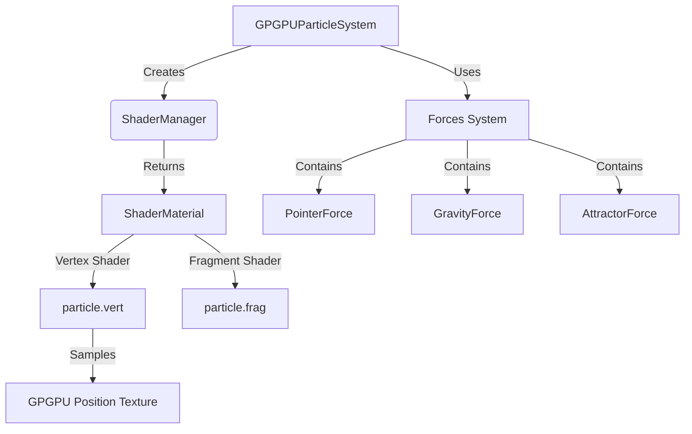

# Fix Particle Rendering and Interaction Functionality

The "visual glitch" and loss of functionality are caused by two issues:

1.  **Material Mismatch**: The system is using a hacked `PointsMaterial` (via `onBeforeCompile`) which introduces unwanted size attenuation and relies on internal behavior, causing visual instability/jitter. The project contains explicit `particle.vert` and `particle.frag` shaders that enforce a stable `gl_PointSize` and correct behavior, but they were unused.
2.  **Texture Filtering**: The GPGPU data textures default to `LinearFilter`, which can cause sampling artifacts during initialization or if the system falls back to them. They must be explicitly set to `NearestFilter`.

This plan switches the rendering to use a `ShaderMaterial` with the dedicated shader files (restoring the intended "functionality") and ensures data integrity with proper texture filtering.---

## Phase 1: Core Fixes

### 1.1 Update `src/core/ShaderManager.js`

-   Import `particle.vert` and `particle.frag`.
-   Refactor `createParticleMaterial` to return a `THREE.ShaderMaterial` instead of `PointsMaterial`.
-   Configure the material with the explicit shaders and correct uniforms.
-   Alias `userData.uniforms = uniforms` for backward compatibility.

### 1.2 Update `src/core/GPGPUParticleSystem.js`

-   Set `minFilter` and `magFilter` to `THREE.NearestFilter` on all data textures.
-   Update uniform access to use `this._particleMaterial.uniforms` directly.

### 1.3 Verify `src/utils/BufferUtils.js`

-   Keep the `+ 0.5` offset fix for UV coordinates.

---

## Phase 2: Shader Improvements

### 2.1 Update `src/shaders/render/particle.vert`

-   Add `uPointSize` uniform for configurable point size.
-   Add distance-based size attenuation for proper 3D perspective.

### 2.2 Update `src/shaders/render/particle.frag`

-   Add fallback when `uColorTexture` is null (use white or highlight color).
-   Ensure proper alpha handling for additive blending.

---

## Phase 3: Extensibility Enhancements

### 3.1 Expose Runtime-Configurable Uniforms

-   Add setter methods in `GPGPUParticleSystem` for:
    - `setPointSize(size)`
    - `setOpacity(opacity)`
    - `setHighlightColor(r, g, b)`
    - `setNoiseParams(frequency, amplitude)`

### 3.2 Add Forces System

-   Create `src/interaction/Force.js` base class.
-   Refactor pointer interaction to use Force system.
-   Enable adding multiple forces (gravity, wind, attractors).

### 3.3 Improve Sampler Interface

-   Ensure all samplers implement consistent `prepare()`, `sample()`, `dispose()`.
-   Add `getUVs()` method to samplers for proper color texture mapping.

---

## Architecture

